# Model Predictive Control GUI

This MATLAB graphical user interface was made for designing and simulating model predictive control and especially reaches out to inexperienced users.

## Getting Started

Download this repository from Github.

### Prerequisites

To use this program, you need at least

+ Windows 10
+ MATLAB (+ Optimization Toolbox) Version 2019b
+ Multi-Parametric Toolbox 3 [1]

[1] [Installation of the Multi-Parametric Toolbox](https://www.mpt3.org/Main/Installation)

### Prepare

1. Open MATLAB
2. Add the Multi-Parametric Toolbox to your MATLAB path

## Using the GUI

The following will give you a brief introduction to the graphical user interface and how it's used. To run the GUI, execute the file "StartGUI.m". This will bring up the window shown below.

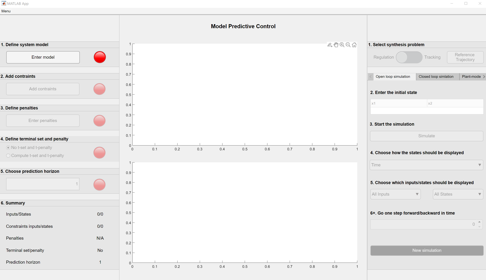

### Input Panel

The Input panel on the left side of the GUI is split up into six smaller panels, which have to be processed from top to bottom. To skip the design process of the MPC, you can load one of the multiple predefined MPC by hitting "Menu-Load MPC" in the top left corner and selecting a MPC in the folder "SavedControllers". If this option was chosen, you can move forward to the section "Simulation panel". Otherwise, proceed with the steps below. For the example used in this guidance, the following OSA was used.

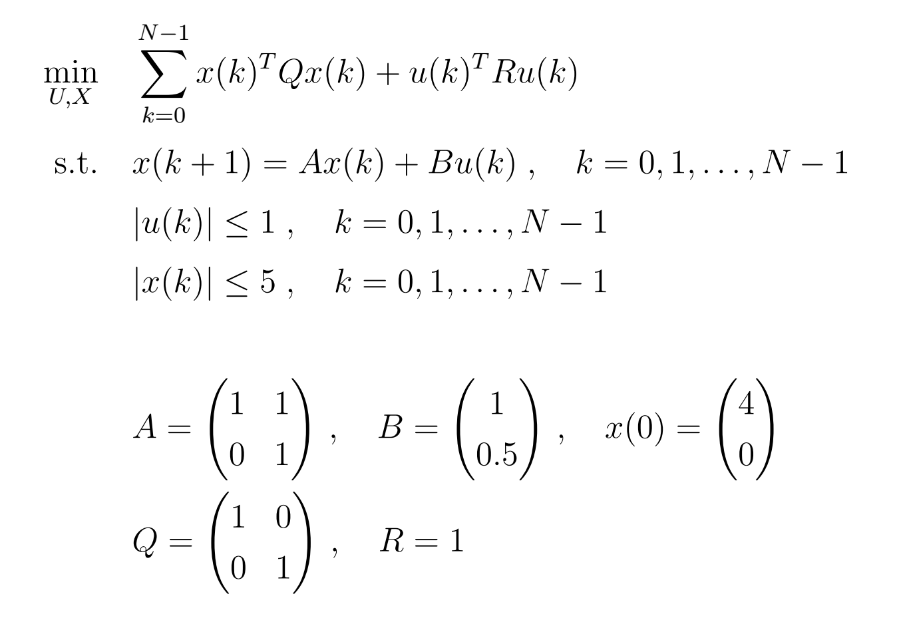

#### 1. Define system model

To enter a linear, time-invariant model in the state-space form x(k+1) = Ax(k) + Bu(k), press the button "Enter model" in the first panel. This will open a new window for the input. If you want to generate a model with one input, two states and the given matrices A and B, the input should be as shown below. Finish this step by pressing the button "Create model".

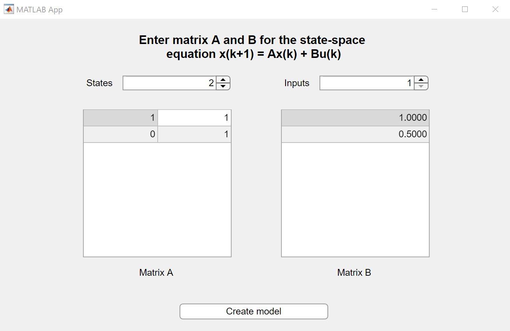

#### 2. Add constraints

In the second step, you can enter constraints for the inputs and states. Therefore press the button "Add constraints" in the second panel. In the new window, enter the minimum and maximum for each variable. For the given example the input should be like the one in the image shown below. Finish this step by pressing "Add constraints". You can skip the definition of constraints by not changing the default values and just pressing the button.

#### 3. Define penalties

The next step deals with penalties for inputs and states. To open this window you have to press the button "Enter penalties" in the third panel. You can choose between a quadratic, one or infinity norm for the calculation in the optimization problem. Here the unit matrix and a quadratic norm are chosen for the matrices R and Q.

#### 4. Define terminal set and penalty

In panel four you can choose if you want to add a terminal set and penalty to the MPC. If you want to enable these parameters, press the second radio button. For this example, the terminal set and penalty stay turned off, which corresponds to selecting the first radio button.

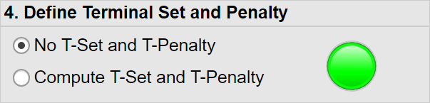

#### 5. Choose prediction horizon

In the last step of the definition process, you have to specify the length of the prediction horizon by entering it in the fifth panel's edit field. Here a prediction horizon of five is chosen. 

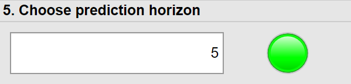

#### 6. Summary

The last panel gives a brief summary of the last five steps. If every parameter has been defined correctly, which means that every control lamp has turned green, the simulation panel will be unlocked. 

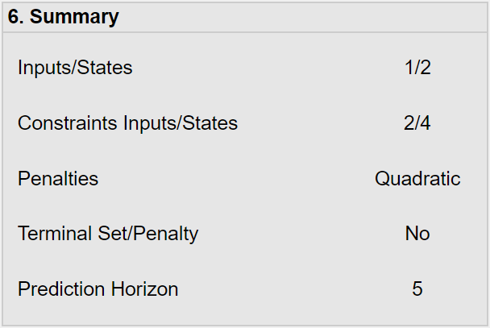

If you want to cancel the definition process and continue it at a later point or just want to store your defined MPC, you can save the MPC through selecting "Save MPC" in the top left corner menu. Then proceed by choosing a folder in which the MPC should be stored.

## Simulation panel

The simulation panel on the right has got several options for simulating the behavior of the defined or loaded MPC. The different methods are organized in a tab group, which will be introduced in the following section.

#### 1. Select synthesis problem

In the first step, you have to choose, if you want to simulate a regulation or tracking problem. If you choose the regulation problem, no further input is needed. In the other case, a reference trajectory for all states has to be defined. To open the input window, press the button on the right side of the switch.

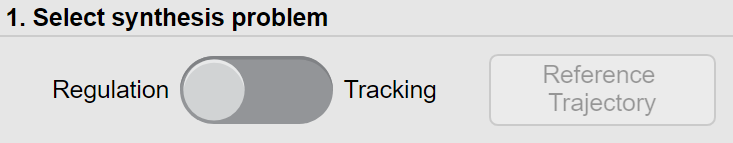

The column "steps" determines how long the set of states in this line will be held. To add a segment with a different set, use the spinner on the right side. The trajectories which result from the table input will be plotted automatically if every field of the table is filled.

### Open Loop Simulation

#### 2. Enter the initial state

To make an open loop simulation, you first have to enter an initial state for the system. This can be done by entering the values into the table intended for this. In this case, an initial state of 4 for x1(0) and 0 for x2(0) is chosen.

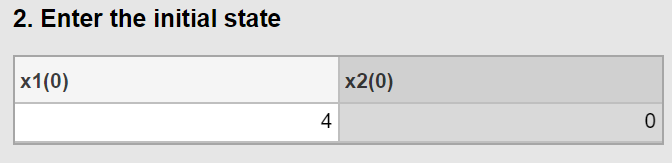

#### 3. Start the simulation

After defining the initial state of the system the simulation can already be started. Therefore press the button "Simulate".

#### 4. Choose how the states should be displayed

In step four of the open loop simulation, you can choose if the states should be displayed over time or in state-space.

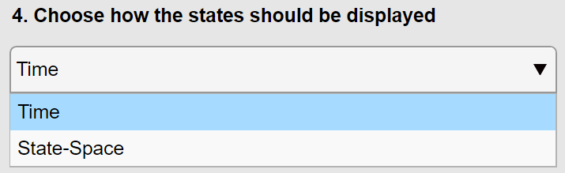

The left image shows a selection of the option "Time" in the dropdown menu, the right image a selection of the method "State-space". If you select state-space the partitions of the explicit MPC will be shown in the background additionally.

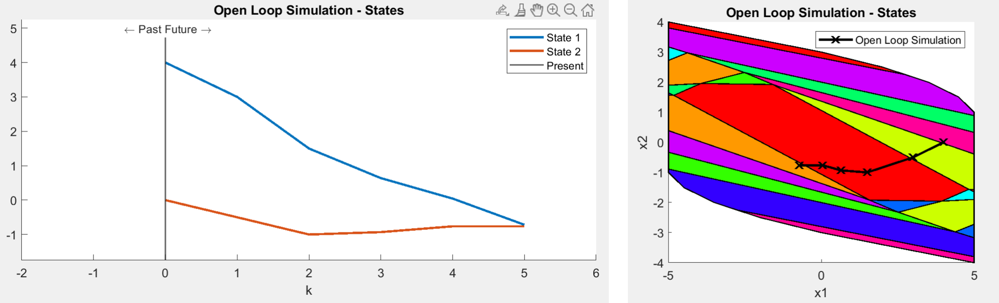

#### 5. Choose which inputs/states should be displayed

In this step, you can choose if you want to display all inputs/states at the same time or if you want to focus on one particular variable. For example, if you select state one in the dropdown menu of this step, only this state will be displayed in the state graph. Also, the constraints of the selected state will be shown in red.

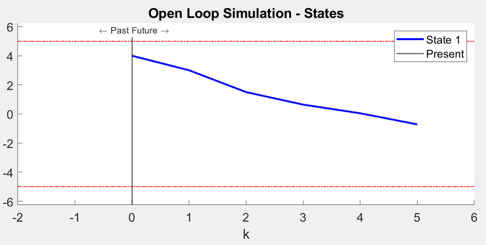

#### 6. Go one step forward/backward in time

With the spinner in the sixth step, you can go one step forward (and backward) in time, which means that the calculated input for the next step will be handed over to the process and a new open loop simulation is triggered. Through this, you can make a step by step closed loop simulation.

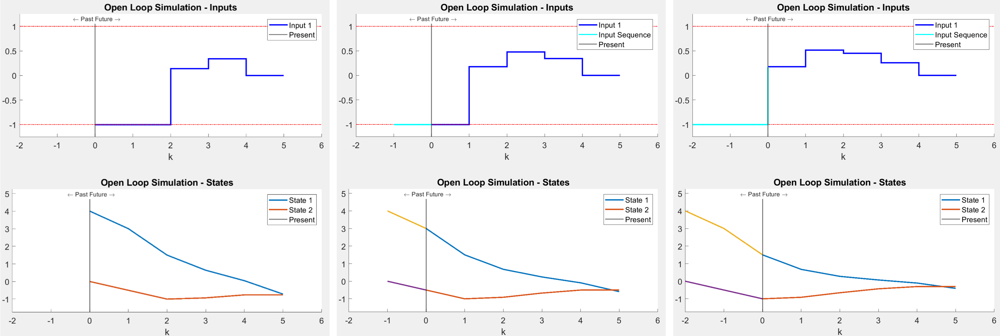

### Closed Loop Simulation

#### 2. Enter the initial state

As in the open loop simulation, the first step is to set an initial state for the system. In this case, an initial state of 4 for x1(0) and 0 for x2(0) is entered into the corresponding table again.

#### 3. Choose how much disturbance should be added

In the next step, you can choose if you want to add a disturbance to the system. If you don't want to add any, enter zero in both edit fields. Otherwise, enter a minimum in the left and a maximum for the disturbance in the right edit field. Random disturbances in this interval will be handed over to the process.

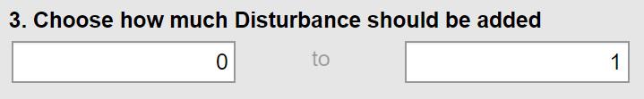

#### 4. Choose number of simulation steps

Step four deals with the number of simulation steps for the closed loop simulation. Simply enter the number in the edit field intended for this. Here a number of 20 steps is selected.

#### 5. Start the simulation

After you defined the previous parameters, press the button "Simulate".

#### 6. Choose how the states should be displayed

This step works exactly like the corresponding step in the open loop simulation. With the dropdown menu, you can select the time or state-space display method again. The following images show some results of the closed loop simulation with and without disturbance and in state-space.

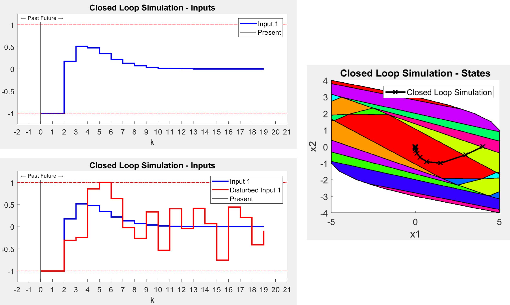

#### 7. Choose which states should be displayed

Again, this step is the same as in the open loop simulation. One specific input/state can be displayed through the dropdown menu for a clearer view and to see the constraints of that variable. On the left, you can see all states for a disturbed closed loop simulation, on the right only state one was selected for display.

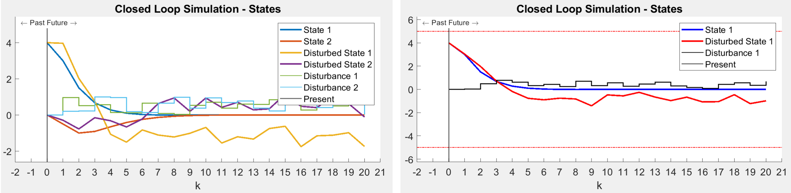

### Plant-model-mismatch

The Plant-model-mismatch tab works nearly the same as the closed loop simulation tab. Therefore the steps aren't explained in detail again. The only difference, besides that no disturbance can be added, is step three, in which you can enter a plant-model-mismatch. You can do this by pressing the button "Enter plant-model-mismatch". This will open the following window.

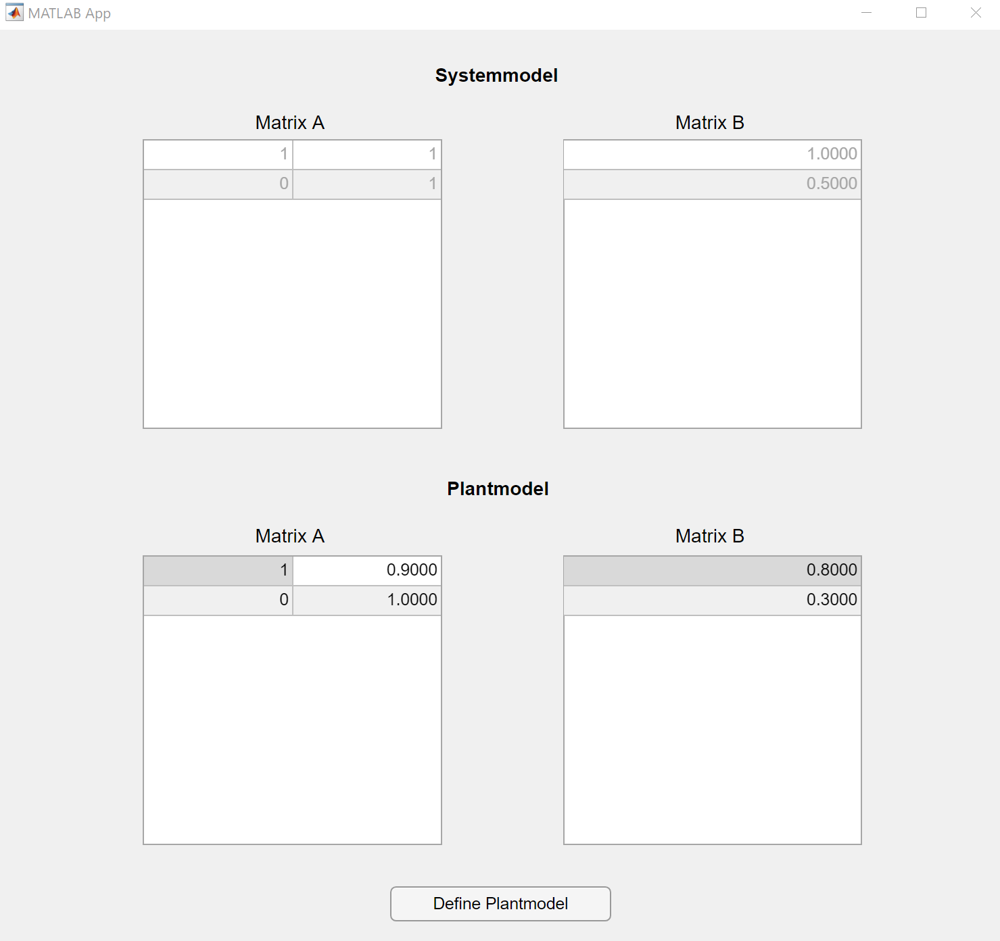

In the first two tables, you can see the matrices A and B of the defined MPC. In the two tables below that, you can see the matrices of the real plant. By default, these matrices match the ones of the MPC. You can generate a mismatch between these by entering different values in the lower two tables. Finish the input by pressing "Define Plantmodel". With this step, you can simulate the behavior of the MPC if the defined model and the real plant model have a mismatch. The results of that simulation for 20 simulation steps are shown below.

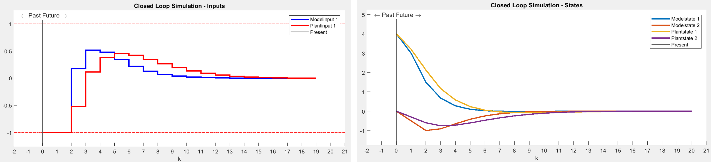

 

### Explicit solution

To show the explicit partitions of the MPC, start the simulation by pressing the button in the explicit solution tab. This feature is only available for MPC with two states. When the results are shown, you can navigate through the partitions with the spinner of step three. The corresponding coefficients of the matrices K and b will be shown in the tables of step four. For partition one, the output is shown in the image below.

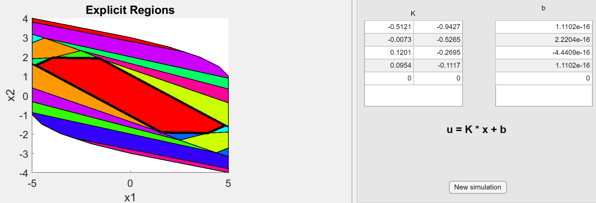

## Author

+ 2020, Georg Breuling ([georg.breuling@rub.de](mailto:georg.breuling@rub.de)), Ruhr University Bochum, [Systems Theory and Automatic Control](https://www.rus.ruhr-uni-bochum.de/)

## License

This project is licensed under the GNU Lesser General Public License - see the LICENSE.txt file for details.

